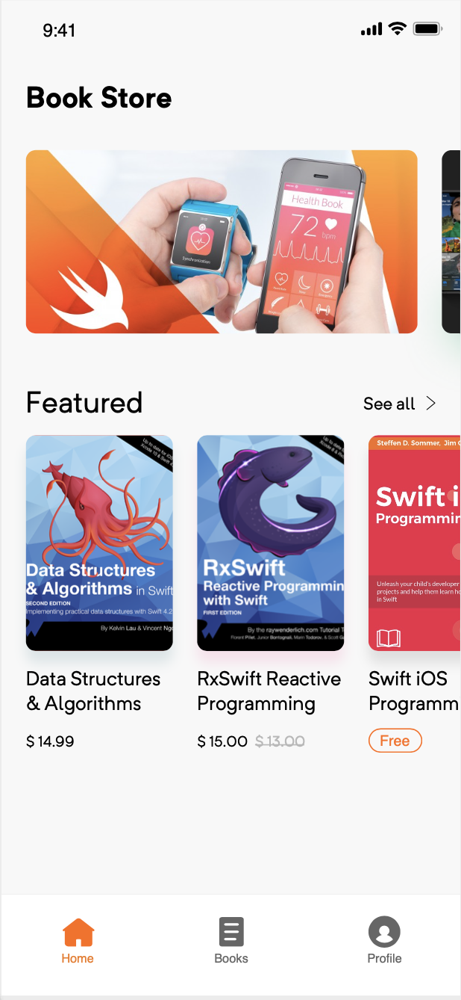
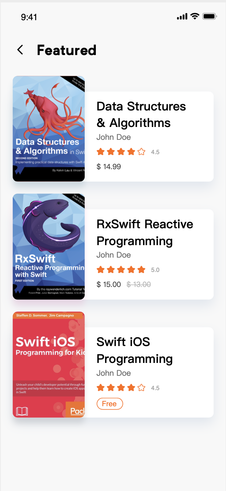
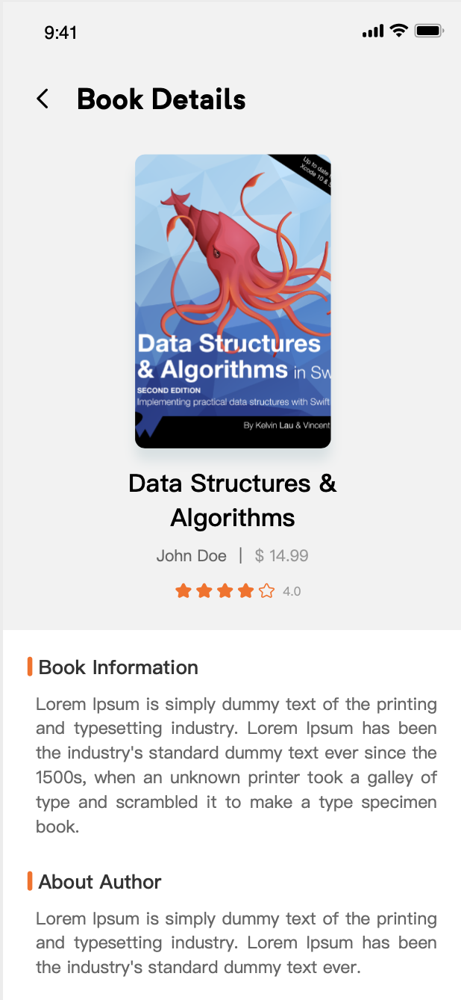
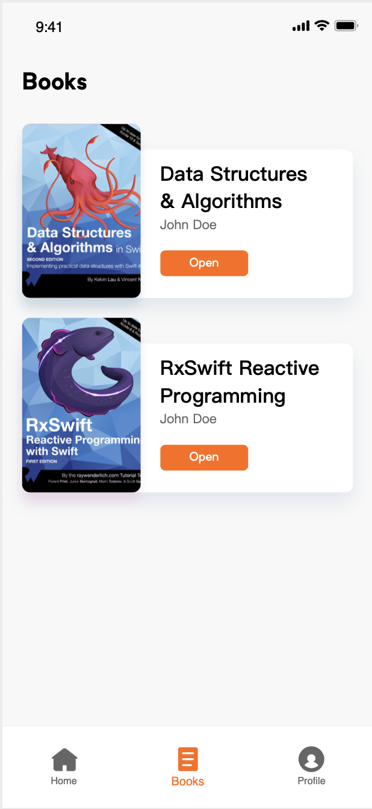
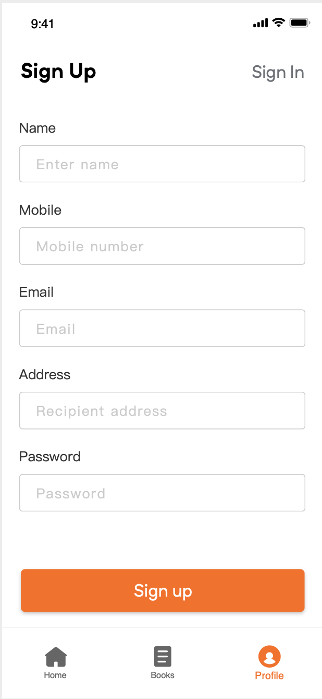
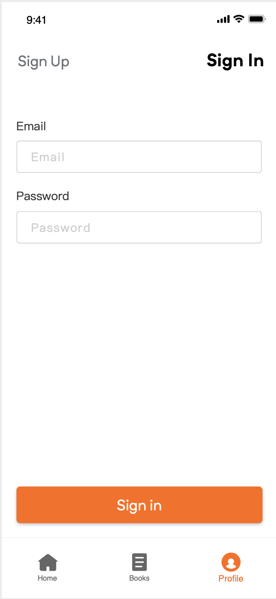

# Book Store App

Book Store App is a simple book library using to show all books in store and you can show the book details to know the price,
author,rate and you can add this book to your books and can make Authentication

# Tools

- ConstraintLayout
- drawable Xml Shapes
- GuidLine
- CircleImageView
- Retrofit
- Widget Group

# Images
              

# Author

Created by Mohamed Sobhy on 2020. Copyright © 2020 Mohamed Sobhy. [LinkedIn](https://www.linkedin.com/in/mohamed-sobhy-040958181/)

# Environment

This project was generated by Android Studio 3.6.1 and Java 

# Further Help

To get more help on the project, you can contact with me by email address m7md.sob7y20@gmail.com

# Note

This project created on 2020, some libraries or code might be depreciated & The Backend maybe expire.
